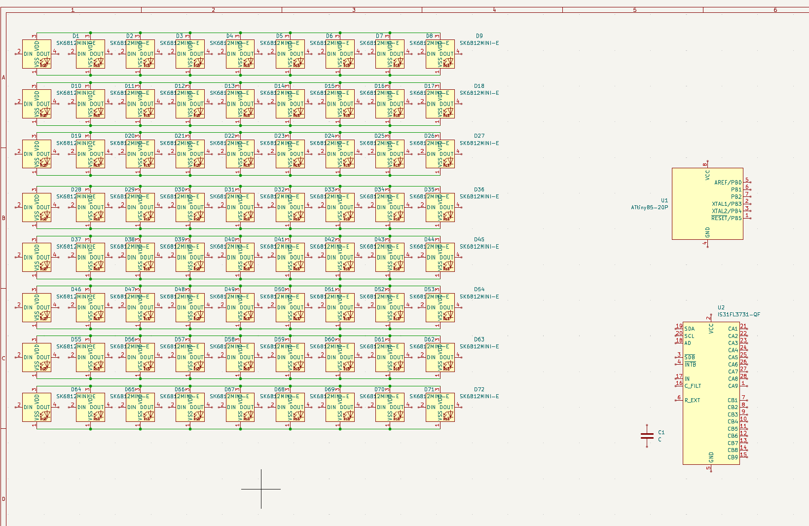
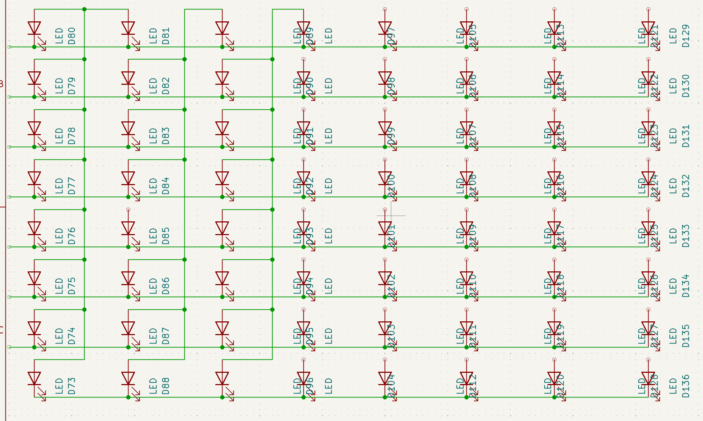
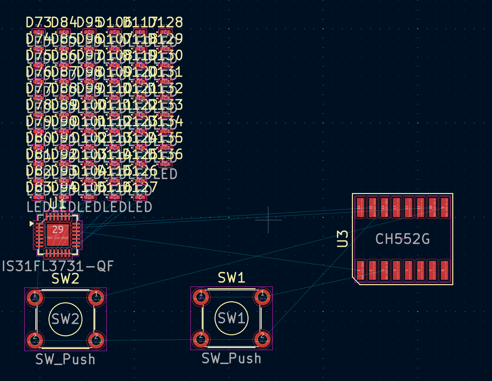
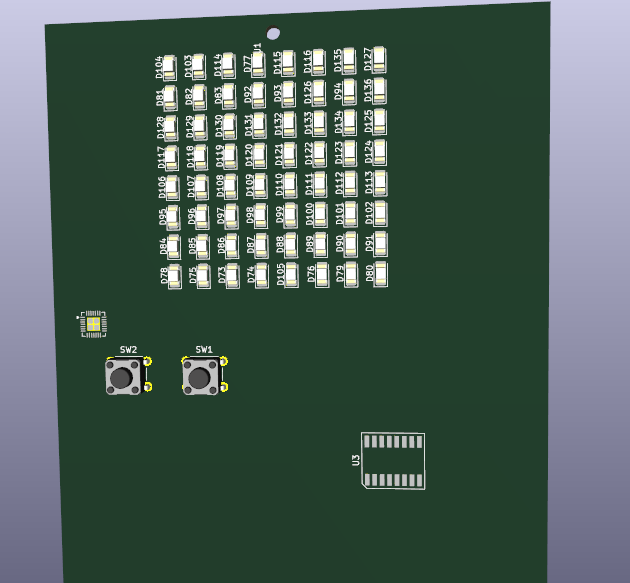
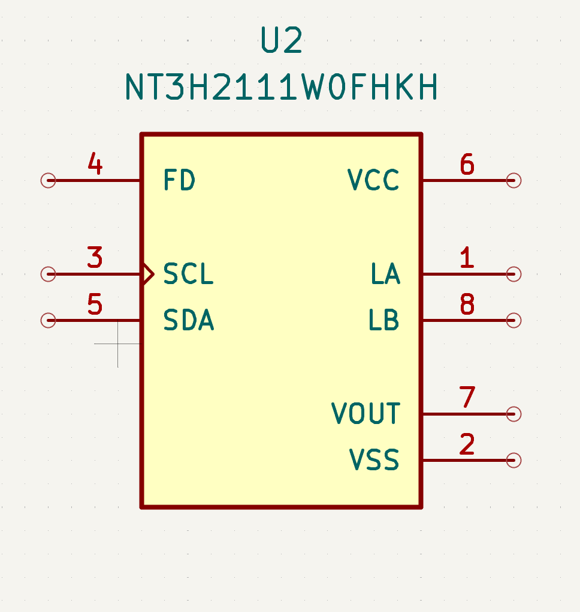
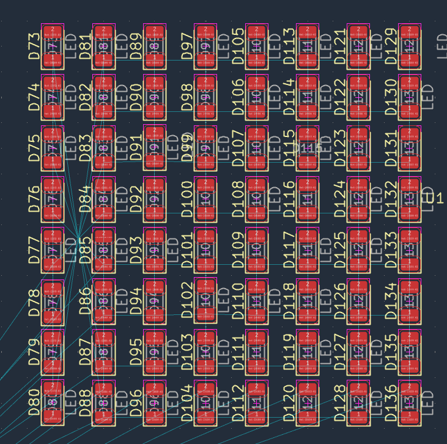
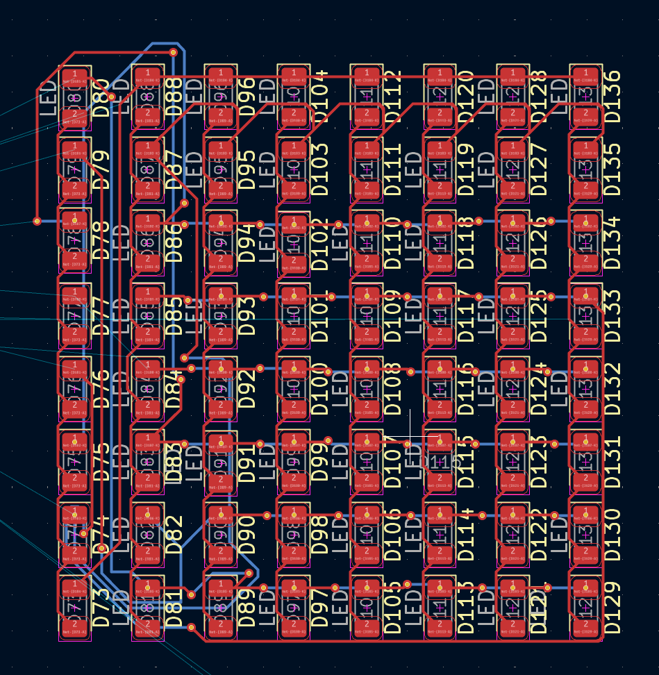
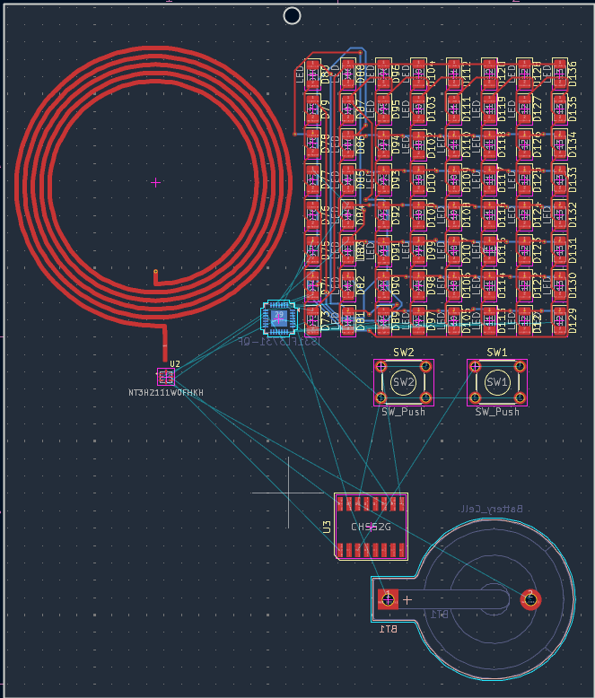
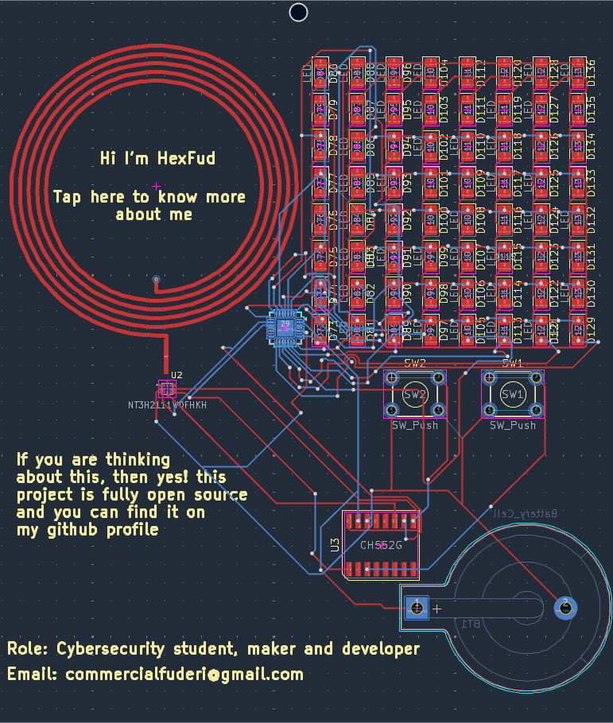
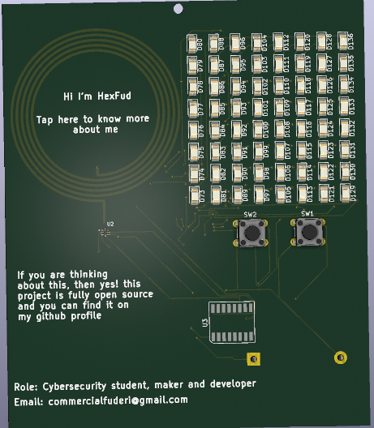

## Day 1 (31 July 2026)

Started to place down some components in kicad but I am still confused on what microcontroller to chose. I need to find something small that has a lot of gpio pins, my first tought is the CH552G because it also has a usb-c port that can be used for flsahing the firmware on the buisness card 

After reading about the microcontroller i finally chose the CH522G, but now i need to change the LEDs because the one i chose are too big and power consuming for what i need to build so i chose something smaller (APT1608)
Update: I decided to build a sort of screen made of LEDs putting on the board an 8x8 led matrix driven by a IS31FL3731-QF led controller. Initially i tought about a single input for all the LED's but while i was wiring them i thought that the couldn' be controlled separately
This is the work in progress matrix:

I ran into a problem, I need to decide what nfc reader to use because i want it to be writable by the microcontroller and has a vast compatiblity with all smartphones. I am reading a lot of documentation but i cannot find the right one. I am going to resume wiring without the nfc reader and add it later

I have now assigned the footprints for all the components and i have to place it in order, i am trying to keep things as small as possible because it is still a badge :)

Finally finished placing the led footprints in a matrix shape (needed to check evry space between them), now i think it is time to check again for the nfc reader/antenna to complete the schematic (maybe I will have more luck)

Finally found the nfc/rfid reader and also the footprint! Now i need to wire it to the other components.

After looking at the wiring path of the leds i noticed that the matrix in the elctrical scheme was totally right but when i started placing the leds on the PCB i didn't put them in order as the scheme. So now i am going to re-order the leds like the schematic to get a more efficient wiring.
Update: After a bit of rotating, moving and replacing LEDs i finally ordered them like the schematic now i can finally start wiring

Finished wiring the LED matrix, now i will start to wire the matrix to the led controller

After searching about and learning more about led matrixes just to confirm my wiring scheme and i ran into a site that said that i need pull-up resistors for the LEDs, so know i am going to wire them and then contniue my jouney. Furthermore i forgot to add the button battery holder to keep the pcb alive even if it is not connected to the usb

Added a button battery and i think i will end the day with this modification. I will continue tomorrow
Update: Sike! I placed all the components in order for the PCB also added a coil as the antenna for the NFC! Now i need to wire all the parts together and then start designing the firmware

## DAY 2 (1 August 2026)

Finally finished the PCB!!! Now i will upload all the pcb and scheme files here and I will start do develop the microcontroller firmware

 

The firmawre is done! Now I need to do some final checks and the project is officaly finished

I officially uploaded all of the files on github! So this project is officially closed for now, maybe in the future i will do some re-design.

Total time spent: 5 hours
